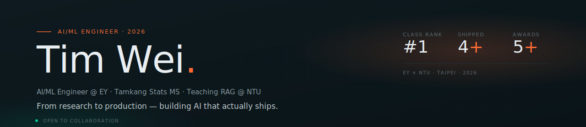
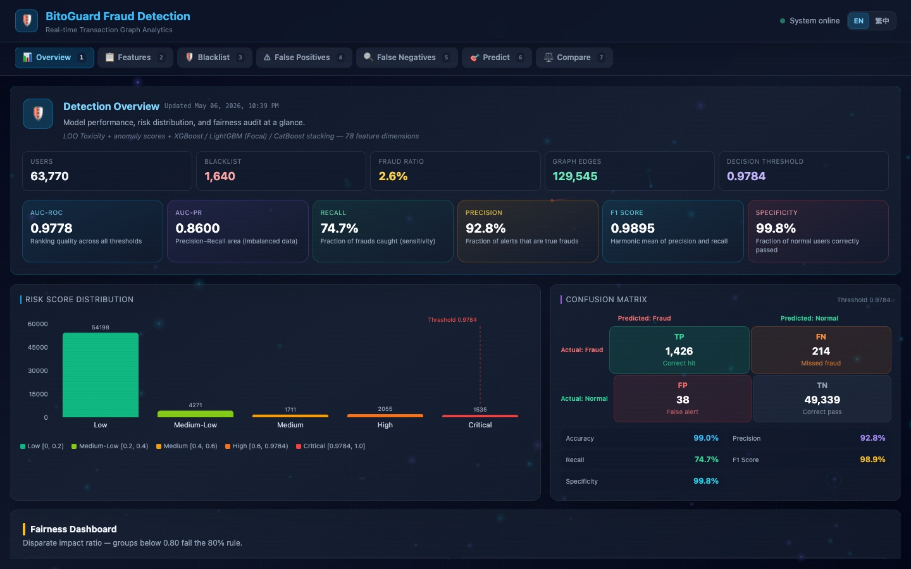
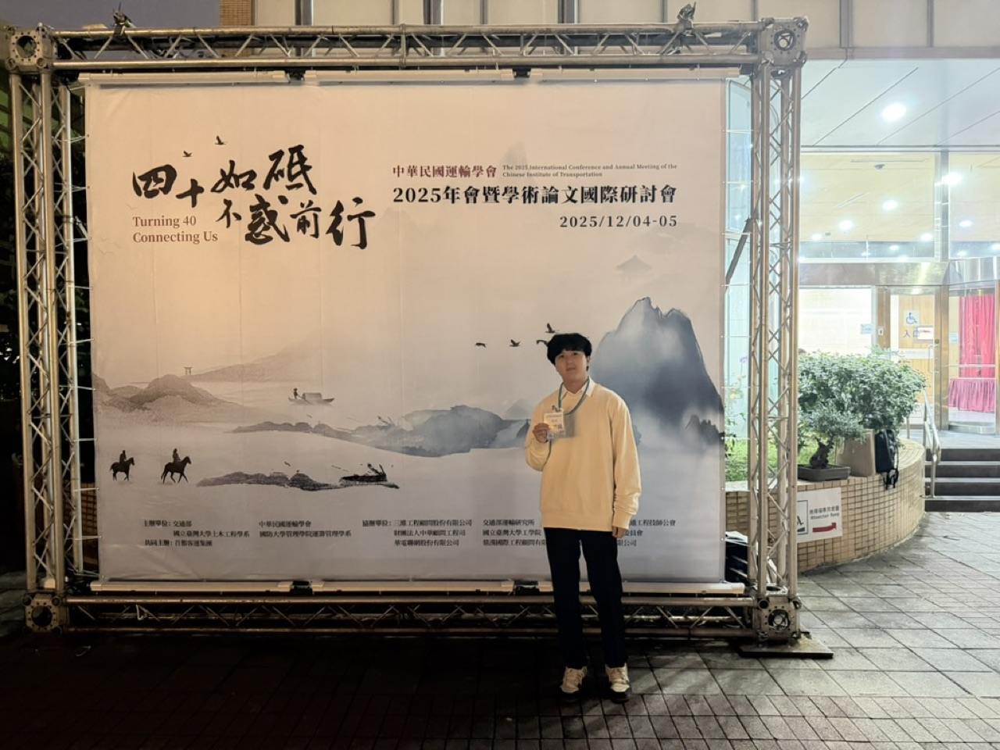
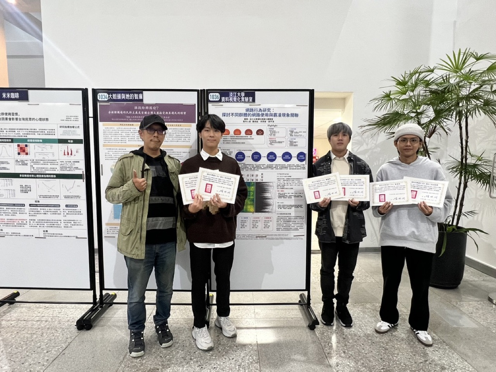

  

  <a href="https://timwei0801.github.io/timwei0801/"><strong>Portfolio →</strong></a>
  &nbsp;·&nbsp;
  <a href="mailto:chwei9181@gmail.com">Email</a>
  &nbsp;·&nbsp;
  <a href="https://linkedin.com/in/timwei0801">LinkedIn</a>
  &nbsp;·&nbsp;
  <a href="https://medium.com/@chwei9181">Medium</a>
  &nbsp;·&nbsp;
  <a href="./README_zh-TW.md">繁體中文</a>

  <em>From financial fraud detection and traffic-flow forecasting to AI explainability and fairness — I believe good models should not only be accurate, but also able to explain themselves.</em>

---

## What I'm doing now

**AI/ML Algorithm Engineer @ Ernst & Young Taiwan** &nbsp;·&nbsp; *2025/07 — Present*

- 🤖 &nbsp; **RAG Knowledge System** — Leading architecture & development of an internal RAG-based knowledge management system (PoC), running locally on **Llama 3.1 via Ollama**.
- 🛒 &nbsp; **Retail ML Recommender** — Real-time product recommendation engine for a major retail chain (PoC), combining user behavior with product nutrition signals, refreshed in 5-minute batches.
- 🏦 &nbsp; **Banking Credit Scoring** — Owning credit-scoring model development for a banking client. Completed SAS Viya certification and supported the client's platform onboarding.
- 🧪 &nbsp; **AI Model Governance** — Owning fairness, explainability and AI capability evaluation for enterprise clients (SHAP analysis + multi-dimension fairness audit).
- 🎓 &nbsp; **EY Corporate Mentor × NTU Accounting** — Mentored a 6–7 student team through a 16-week, 3-hour-per-week RAG project (Spring 2026 — completed, final reports delivered).

---

## Highlights

| | |
|:---|:---|
| 🥇 &nbsp; **#1 Graduate** | Graduated ranked #1 in department — Tamkang Statistics & Data Science (2026) |
| 🧑‍🏫 &nbsp; **Outstanding TA** | 3 consecutive semesters + academic award — Tamkang Stats |
| 💰 &nbsp; **Scholarship** | 2025 Accounting Association Scholarship (NT$20,000) |
| 🎓 &nbsp; **Phi Tau Phi** | Honorary member, nominated by Tamkang Stats (2026) |
| 🛡️ &nbsp; **Hackathon Finalist** | DIGITIMES × AWS · Agent for Truth 2026 — *BitoGuard* |
| 🥈 &nbsp; **2nd Place (1st vacant)** | National Highway Intelligent Traffic Competition 2025 |
| 🎤 &nbsp; **Invited Speaker** | Chinese Institute of Transportation Annual Conference 2025 |
| 🏆 &nbsp; **Best Popularity + Merit** | Academia Sinica Data Science Stroll 2024 — dual award |

---

## Selected work

### 🛡️ &nbsp; BitoGuard — Compliance Risk Radar
*Hackathon finalist · DIGITIMES × AWS 2026*

AI-driven crypto fraud detection across **63,770 users · 129,545 graph edges**. **HeteroSAGE + GAT** heterogeneous GNN with stacking ensemble (XGBoost + LightGBM + CatBoost) on a 78-dim feature space. SHAP explainability and 4-dimension fairness audit baked in.

  

### 🚗 &nbsp; Highway Traffic Prediction — Deep Learning × Physics Shockwave
*2nd Place (1st vacant), National Highway Comp. 2025 · Invited talk at Transportation Annual Conference*

Dual-engine architecture combining **MT-STNet** (spatio-temporal GNN) with **LWR shockwave theory** for accurate congestion prediction and real-time alerts. RAG decision support adds explainability on top of prediction.

  

### 📊 &nbsp; Cyberbullying Research — Multivariate Analysis × GAP
*Best Popularity + Merit Award · Academia Sinica 2024*

First application of **Generalized Association Plots (GAP)** to cyberbullying research. Combined with PCA, factor analysis and CCA, identified **5 user clusters** and **4 behavioral factors** from 672 respondents.

  

---

## Tech I work with

**AI / ML** &nbsp;·&nbsp; PyTorch · PyG · GNN (HeteroSAGE / GAT) · RAG · LLM · Ollama · XGBoost · LightGBM · CatBoost · SHAP

**Languages** &nbsp;·&nbsp; Python · TypeScript · Java · R · SAS · SQL

**Frontend** &nbsp;·&nbsp; Vue 3 · React 18 · Tailwind · D3.js · Three.js

**Backend & Infra** &nbsp;·&nbsp; FastAPI · Node.js · Spring Boot · Docker · AWS · Linux · MySQL

**Statistics** &nbsp;·&nbsp; Multivariate Analysis · GAP · PCA · CCA · Factor Analysis

**Specialized** &nbsp;·&nbsp; SAS Viya · MT-STNet · Fairness Audit

**Certified** &nbsp;·&nbsp; Azure AZ-900 · AI-900 · DP-900 · SAS Base · ESG Junior Manager

  
  &nbsp;
  

---

## Public thinking

- 📚 &nbsp; [Claude Code Field Manual — a beginner-friendly zh-TW tutorial series (G1~G20, ongoing)](https://ithelp.ithome.com.tw/users/20182796/articles) &nbsp;·&nbsp; *iThome · 2026*
- 📰 &nbsp; [When 97% of Your Data Lies — Extreme Imbalanced Classification in Crypto AML](https://medium.com/@chwei9181/篇一-當-97-的資料都在騙你-加密貨幣反洗錢中的極度不平衡分類實戰-627275bc9944) &nbsp;·&nbsp; *Medium · 2025*
- 📰 &nbsp; [Building a Portfolio in One Day with AI — Claude Code Collab Reality Check](https://medium.com/@chwei9181/我用-ai-在一天內完成個人網站-與-claude-code-協作開發的真實體驗-e315f00e365a) &nbsp;·&nbsp; *Medium · 2025*

---

  Open to AI/ML collaborations, talks, and tech discussions. 
  <a href="mailto:chwei9181@gmail.com">chwei9181@gmail.com</a>

